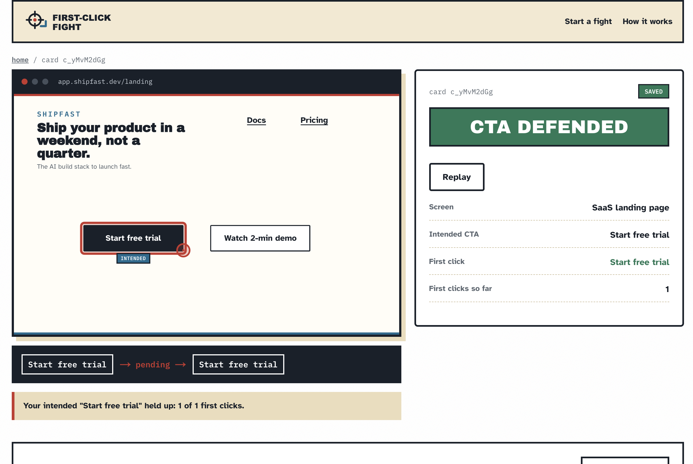
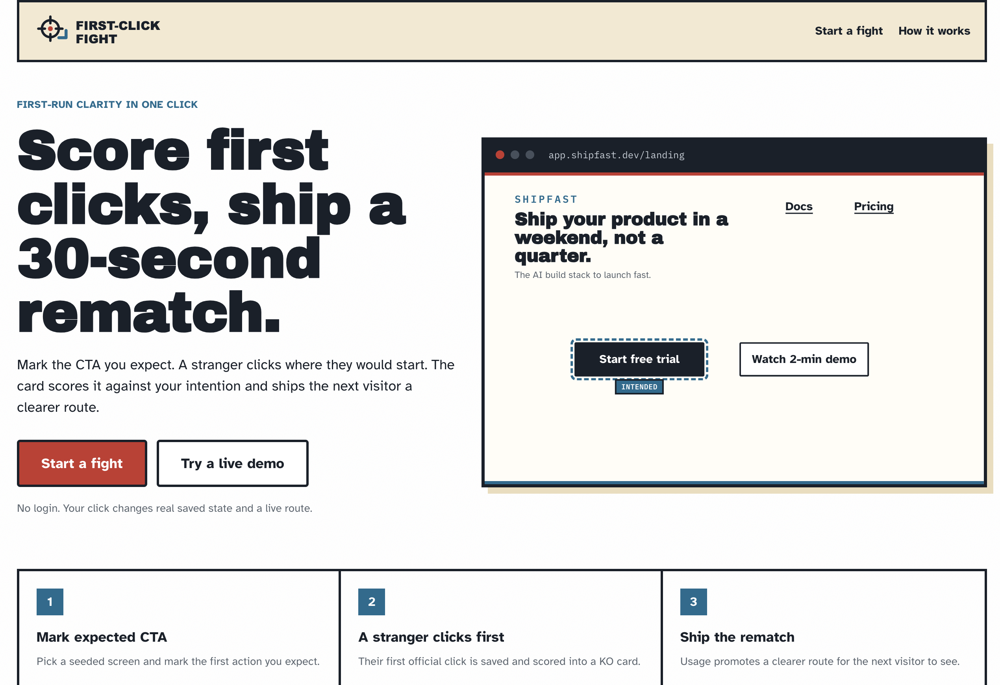
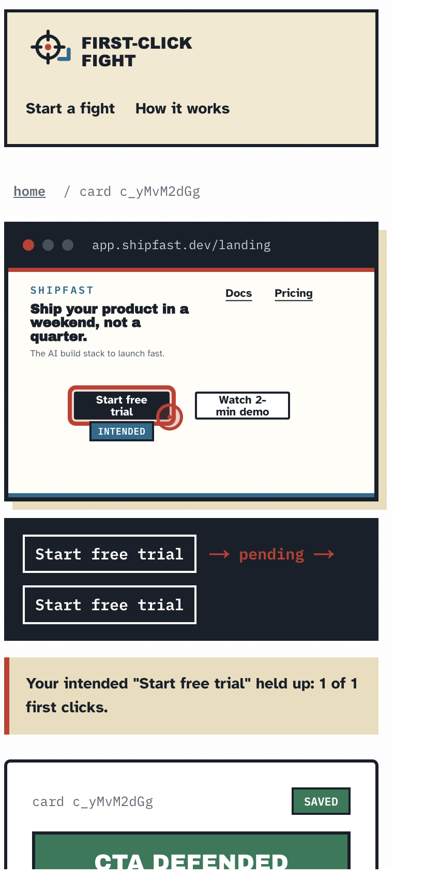

# First-Click Fight

### Score first clicks, then ship a 30-second rematch

Mark the call to action you expect. A fresh visitor clicks once where they would start, that first click is saved and scored into a Clarity KO Card, and the next visitor gets a clearer route. No login, and every click changes real state you can reopen at a stable link.

**Live demo:** https://first-click-fight.veithly.workers.dev

[Open a saved KO card](https://first-click-fight.veithly.workers.dev/card/c_yMvM2dGg) · [Inspect the usage feed](https://first-click-fight.veithly.workers.dev/api/usage) · [Architecture](./docs/ARCHITECTURE.md)

---

## Try it in 60 seconds

1. Open the live app and press **Start a fight**.
2. Pick a seeded product screen and click the call to action you expect a stranger to use first. That marks your intended CTA.
3. Copy the fight link, open it in a private window (you are now the fresh visitor), and click once where you would actually start.
4. The screen freezes your click and renders a **Clarity KO Card**: `CTA_DEFENDED` if the visitor hit your intended target, `CTA_KNOCKED_OUT` if a different element won.
5. Open the card link again, or scan its QR on a phone. The saved click, route ribbon, and tally reload identically.

You never sign in. Every step above writes a real row you can reopen.

## What a first click changes

| Situation | Before | With First-Click Fight |
| --- | --- | --- |
| Checking if a landing CTA reads as obvious | Ask friends who already know the product and over-explain it | A fresh visitor's first click is saved and scored against the CTA you marked |
| Reacting when the wrong element wins | Wait weeks for post-launch analytics | Ship a rematch route in 30 seconds that promotes the most-clicked target |
| Showing a teammate what happened | Describe it from memory | Send a stable card link or QR that replays the exact click |



**Step 1.** Mark the CTA you expect on a seeded screen, then share the fight.



**Step 2.** Reopen the saved card on a phone and replay the same click.

## Open the result and re-run it

Every public claim points at a route you can open or a file you can read.

| Product result | Where to check |
| --- | --- |
| A visitor's first click is saved and scored into a KO card | Open `/card/[cardSlug]`; the row is written in `src/app/api/fights/[id]/clicks/route.ts` and `src/lib/scoring.ts` |
| Usage decides the rematch, not a guess | `GET /api/usage?fightId=...` returns the recorded events, per-target tally, and the learning line from `src/lib/usage.ts` |
| The result reopens for a second visitor | Reload `/card/[cardSlug]` in another browser; server join lives in `src/lib/fights.ts` (`getCardView`) |

To re-run a result yourself, open `/card/[cardSlug]` in a second browser or scan its QR on a phone. The same verdict, click point, and tally reload from D1, so the saved card is reproducible rather than a screenshot.

## How the loop works

```mermaid
flowchart LR
  mark["Builder marks intended CTA"] --> fight["Fight link /fight/[id]"]
  fight --> click["Visitor first click saved (clicks row)"]
  click --> score["Clarity KO Card (cards row)"]
  score --> usage["usage_events recorded in D1"]
  usage --> rematch["Rematch route /rematch/[id]"]
  rematch --> visitor2["Next visitor sees the clearer route"]
```

| Decision | Picked | Why it changes the product |
| --- | --- | --- |
| Core mechanism | First official click per visitor session, scored against the marked target | Removing it leaves only opinions; the click is the evidence |
| State | Cloudflare D1 rows for `fights`, `clicks`, `cards`, `usage_events` | The result can be reopened, replayed, and tallied long after the visit |
| Identity | Guest session cookie, plus a signed owner key in the share link | A stranger can play with no login while only the owner can ship a rematch |

Full data model and boundaries live in [`docs/ARCHITECTURE.md`](./docs/ARCHITECTURE.md).

## The usage-learning loop

First-Click Fight is built around the idea that recorded usage, not a hunch, should decide what ships next. Four event types land in a D1 `usage_events` table: `fcf_fight_created`, `fcf_first_action_clicked`, `fcf_result_inspected`, and `fcf_rematch_shipped`. `buildUsageSummary` in `src/lib/usage.ts` rolls the official clicks into a per-target tally and a single learning line, and that tally is exactly what decides whether the rematch defends your intended CTA or promotes the challenger a stranger actually clicked.

You can read the whole feed for any fight at `GET /api/usage?fightId=...`. The repository is structured so a usage-analytics product such as Novus by Pendo can be connected later and replace the first-party tally; the connection steps live in [`docs/NOVUS.md`](./docs/NOVUS.md).

## Run it locally

```bash
git clone https://github.com/veithly/first-click-fight.git
cd first-click-fight
cp .env.example .env.local
npm install
npm run dev
```

Open `http://localhost:4387`, press **Start a fight**, and run the same loop described above. Local data is served by a Wrangler D1 binding, so saved cards persist between reloads.

## Under the hood

| Layer | Choice | Product reason |
| --- | --- | --- |
| Product surface | Next.js App Router on Cloudflare Workers | The fight link, card, and rematch route are server-rendered so a stranger sees real state on first load |
| State | Cloudflare D1 (SQLite) | Clicks, cards, and usage events are relational rows a reviewer can reopen or re-run |
| Identity | Guest cookie set in `src/middleware.ts`, owner key signed with HMAC-SHA256 | No-login play for visitors, owner-only rematch for builders |
| Interface | Mantine plus a hand-set editorial theme and `motion` for the click-to-card beat | The screen reads like a product, not a default template |

## What is not in this cut

- Product screens are seeded; uploading your own screen is the next milestone.
- History is per fight; multi-fight team dashboards are out of scope here.
- The usage tally is first-party; connecting Novus by Pendo is documented in [`docs/NOVUS.md`](./docs/NOVUS.md).

## Repository map

```text
.
├── src/app/        product routes, server actions, and API handlers
├── src/components/  product UI and the editorial theme
├── src/lib/         scoring, fights, usage, and D1 helpers (server only)
├── migrations/      D1 schema for fights, clicks, cards, usage_events
├── public/          brand assets and product screenshots
└── docs/            architecture, deployment, and Novus connection notes
```

## License

MIT.
